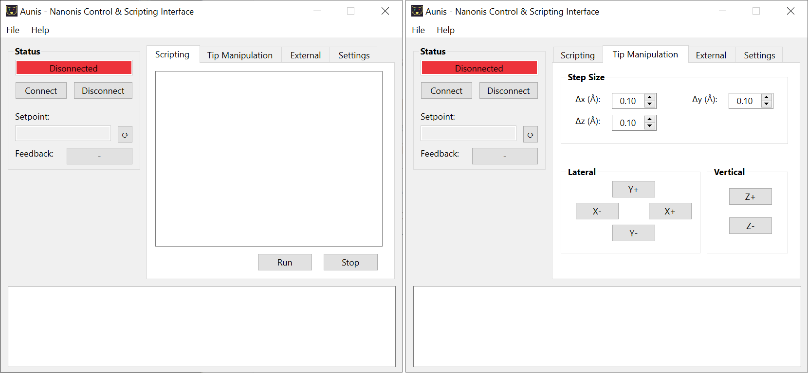

# Aunis - Nanonis Control & Scripting Interface
Aunis is a control and scripting interface in Python for automating measurements within the [Nanonis Mimea™ SPM control system](https://www.specs-group.com/nanonis/products/mimea/).

The only prerequisite is that you have a Nanonis Mimea system including programming interface. All commands provided via the Nanonis TCP interface can be integrated into Aunis without programming knowledge. For this purpose, the commands only have to be included in the special JSON files. Furthermore, it also allows to connect to external TCP interfaces and to send commands.

Current version 0.32 (04.05.2025)



## Installation
Clone the Github repository using

<code>git clone https://github.com/noisyn/Aunis</code>

## Dependencies
Aunis requires the following libraries:
- numpy
- scipy
- PySide6

## Documentation
A user manual can be found here: [Manual](Manual/manual.pdf).

### Example
The following example initially sets the bias voltage to 0.1 V. Then it scans an image, increases the bias voltage by 0.1 V, waits for 10 s and repeats the whole process 10 times.

```
setBias 0.1

repeat 10
doScan
waitEndScan
addBias 0.1
wait 10
end
```

### External TCP interfaces
New TCP interfaces can be added by creating a new JSON file in the "/cmds/external" folder. The structure of the file follows the command structure of the normal commands. Additionally, the entry "Interface" must be created. This contains the parameters for the TCP connection. For the specification of the commands see the section Adding new commands - External commands.

Here is an example to illustrate the syntax of the “Interface” entry:

```json
    "Interface": {
        "Name": "QuPe",
        "IP-Adress": "127.0.0.1",
        "Port": 1337
    }
```

### Adding new commands
#### Normal commands
The functionality of Aunis can be easily extended by adding new commands via the JSON file "commands.json" in the folder "/cmds". For this purpose, in addition to the name/alias of the new command, the specific arguments for the command must also be defined. This includes the type as well as a default value for the argument. Furthermore, it is possible to specify which arguments can be set via the scripting interface and for which the default values should be used.

Here is an example to illustrate the syntax and structure of a new entry/command:

```json
    "setXY": {
        "cmdName": "FolMe.XYPosSet",
        "argTypes": {
            "X (m)": "d",
            "Y (m)": "d",
            "Wait end of move": "I"
        },
        "argValues": {
            "X (m)": 0,
            "Y (m)": 0,
            "Wait end of move": 1
        },
        "args": [
            "X (m)",
            "Y (m)"
        ],
        "respTypes": {}
    }
```

- The name of the new command is **setXY**.
- The entry **cmdName** specifies the function that is made available via the TCP Programming Interface and is to be executed. In this case the function "FolMe.XYPosSet".
- The entry **argTypes** defines the arguments and their types. These follow directly from the Nanonis TCP protocol. The function "FolMe.XYPosSet" expects the three arguments "X (m)" [type: float64], "Y (m)" [type: float64] and "Wait end of move" [type: unsigned int32]. The types are specified according to the definition in the [struct module](https://docs.python.org/3/library/struct.html#format-characters), i.e. in this case "d" (float64) and "I" (unsigned int32).
- The entry **argValues** defines default values for the individual arguments. These are only used if the respective argument is not made available via the scripting interface.
- The entry **args** specifies which arguments and in which order they can be set from the scripting interface. In this example only the arguments "X (m)" and "Y (m)" can be set. For the argument "Wait end of move" the default value is always used.
- The last entry **respTypes** defines the return values. The syntax for the last entry is similar to that of **argTypes**. The arguments and their types can be taken from the Nanonis TCP protocol. In this example, no return values are specified. See the next example for the use of return values.

The new command **setXY** then has the following syntax within the scripting interface: **setXY \[X\] \[Y\]** 

Example of a call would be: **setXY 5e-9 -30e-9**

Here is another example to illustrate the handling of return values:

```json
    "getZ": {
        "cmdName": "ZCtrl.ZPosGet",
        "argTypes": {},
        "argValues": {},
        "args": [],
        "respTypes": {
            "Z position (m)": "f"
        }
```

- The last entry **respTypes** defines the return values. The syntax for the last entry is similar to that of **argTypes**. The arguments and their types can be taken from the Nanonis TCP protocol. In this case there is only the return value "Z position (m)" [type: float32].

#### Special command
Special commands go beyond the capabilities of the normal commands provided through the Nanonis TCP interface and their functionality must be implemented in Python. First, the special commands have to be created in the same way as the normal commands via the JSON file "special_commands.json" in the folder "/cmds". The syntax and structure follows that of the normal commands. However, only the name/alias and **argTypes** and **args** need to be specified in more detail. All other entries are omitted. Furthermore, the functionality of the special commands must be hardcoded in "PyNanonis.py" in the function <code>specialCommand(self, cmdAlias, cmdArgs)</code>.

Here is an example to illustrate the syntax and structure of a new entry/command:

```json
    "wait": {
        "argTypes": {
            "Time (s)": "I"
        },
        "args": [
            "Time (s)"
        ]
    }
```
#### External command
External commands are created in the same way as normal commands. For each new TCP interface, a separate JSON file must be created in the folder "/cmds/external". These must also contain the entry "Interface" as described in section External. The entry **respTypes** can be omitted.

Here is an example to illustrate the syntax and structure of a new entry/command:

```json
"doRFSweep": {
        "cmdName": "constantAmplitudeSweep",
        "argTypes": {
            "StartFreq (Hz)": "s",
            "EndFreq (Hz)": "s",
            "Vrf (V)": "s"
        },
        "argValues": {
            "StartFreq (Hz)": "200e6",
            "EndFreq (Hz)": "800e6",
            "Vrf (V)": "5e-3"
        },
        "args": [
            "StartFreq (Hz)",
            "EndFreq (Hz)",
            "Vrf (V)"
        ]
    }
```
Note that for the **argTypes** entry only the type string "s" is supported, since all commands are sent as bytes representation of the Unicode string. The conversion to the correct data types must be done on the server side.

The example shown here can be executed by calling <code>doRFSweep 400e6 800e6 10e-3</code> via the scripting interface. Then the string <code>constantAmplitudeSweep 400e6 800e6 10e-3</code> would be sent in bytes representation to the specified TCP interface.

## License
This project is licensed under the [MIT License](LICENSE).